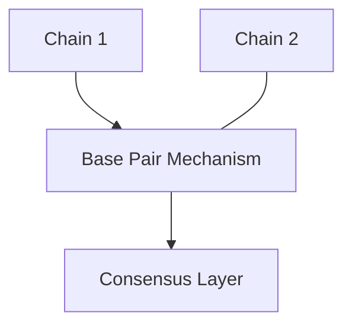
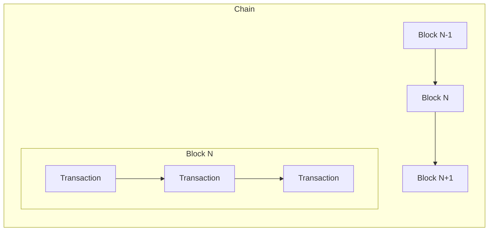
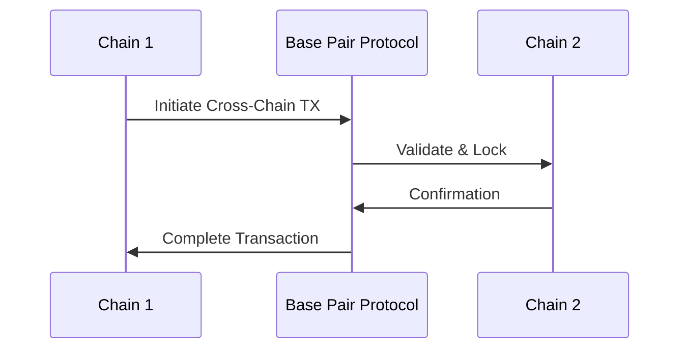
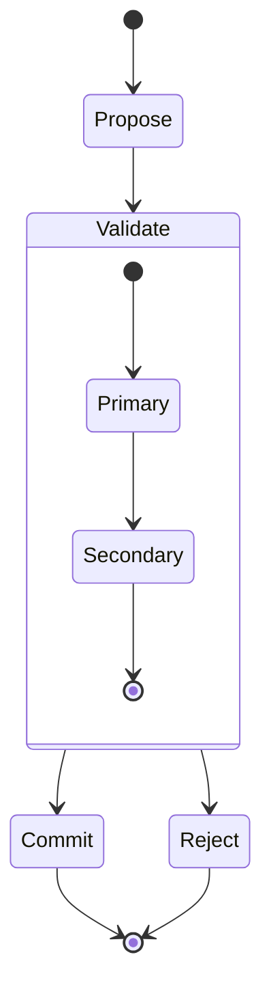

## System Architecture

Adaptique's architecture draws inspiration from DNA's double helix structure, implementing a multi-chain system with secure cross-chain communication.

### Core Components

#### 1. Helical Chains
- Multiple parallel chains running simultaneously
- Each chain specialized for specific transaction types
- Implemented as independent Rust threads for optimal performance
- Asynchronous processing using Tokio runtime

#### 2. Base Pair Mechanism
- Cross-chain communication protocol
- Atomic operations between chains
- Zero-knowledge proofs for secure validation
- Lock-free data structures for high throughput

#### 3. Consensus Layer
- Hybrid consensus mechanism
- Primary consensus on individual chains
- Secondary consensus for base pair validation
- Byzantine fault tolerance across chains

### System Design

#### High-Level Architecture

#### Chain Structure

#### Cross-Chain Communication Flow

#### Consensus Mechanism

### Architectural Advantages

#### 1. Scalability
- **Parallel Processing**: Multiple chains can process transactions simultaneously
- **Specialized Chain Optimization**: Each chain can be optimized for specific transaction types
- **Horizontal Scaling**: New chains can be added to handle increased load
- **Independent Throughput**: Performance of one chain doesn't affect others

#### 2. Security
- **Compartmentalization**: Issues in one chain don't compromise the entire system
- **Multi-Layer Validation**: Both chain-level and cross-chain validation mechanisms
- **Zero-Knowledge Proofs**: Enhanced privacy in cross-chain communications
- **Byzantine Fault Tolerance**: System remains operational even if some nodes fail

#### 3. Flexibility
- **Modular Design**: Chains can be upgraded or modified independently
- **Protocol Adaptability**: Base Pair Mechanism can evolve without disrupting chain operations
- **Custom Chain Rules**: Different consensus rules can be implemented per chain
- **Feature Isolation**: New features can be tested on specific chains before wider deployment

#### 4. Performance
- **Reduced Bottlenecks**: Lock-free data structures minimize contention
- **Optimized Resource Usage**: Asynchronous processing with Tokio runtime
- **Efficient Cross-Chain Operations**: Atomic operations through Base Pair Mechanism
- **Load Distribution**: Traffic naturally distributed across specialized chains

#### 5. Developer Experience
- **Clear Separation of Concerns**: Each chain has distinct responsibilities
- **Simplified Testing**: Chains can be tested in isolation
- **Maintainable Codebase**: Modular architecture enables focused development
- **Flexible Deployment**: Chains can be deployed and scaled independently
