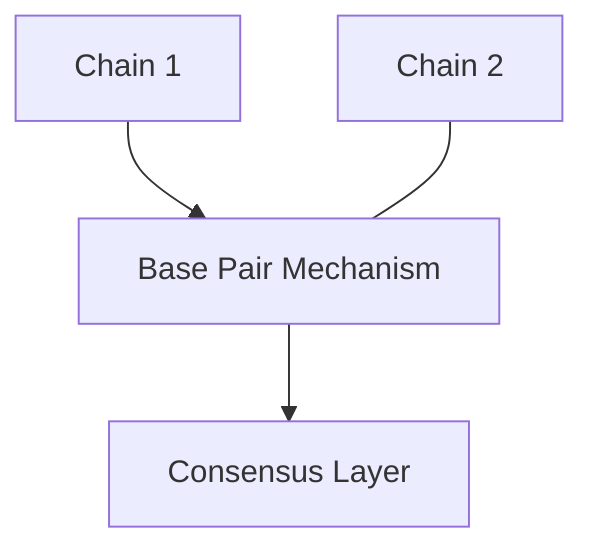
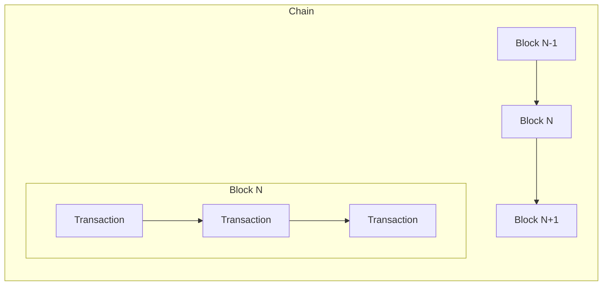
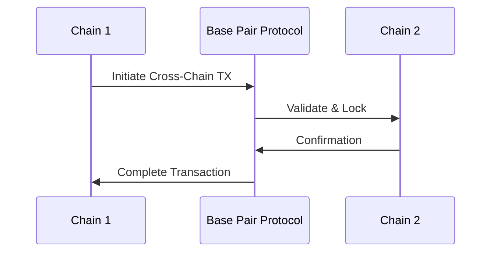
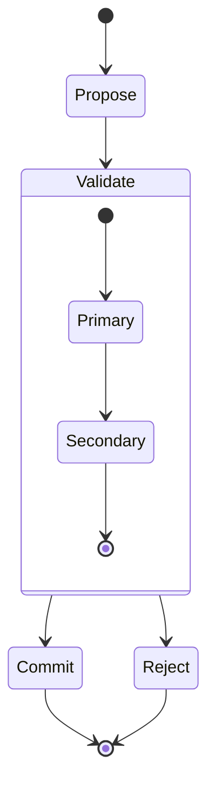

## System Architecture

Adaptique's architecture draws inspiration from DNA's double helix structure, implementing a multi-chain system with secure cross-chain communication.

### Core Components

#### 1. Parallel Strands
- Multiple independent chains operating concurrently
- Purpose-built chains for specific transaction types (e.g., DeFi, NFTs, governance)
- Implemented as independent Rust threads for optimal performance
- Asynchronous processing using Tokio runtime
- Customizable validation and proposal mechanisms per strand
- On-chain validation code storage and execution
  - WASM-based validation modules for safe execution
  - Upgradeable validation logic through governance
  - Support for multiple versions during transition periods
  - Seamless forking capabilities through validation rule updates

#### 2. Base Pair Mechanism
- Cross-chain communication protocol enabling:
  - Asset transfers and atomic swaps
  - Cross-chain collateralization
  - Identity and reputation sharing
  - Interoperable gaming assets
- Atomic operations between chains with rollback capability
- Zero-knowledge proofs for secure validation and privacy
- Lock-free data structures for high throughput
- Smart contract interfaces for cross-chain operations
- Standardized messaging protocol for chain interoperability

#### 3. Consensus Layer
- Hybrid consensus mechanism
- Primary consensus on individual chains
- Secondary consensus for base pair validation
- Byzantine fault tolerance across chains

### System Design

#### High-Level Architecture



#### Chain Structure



#### Cross-Chain Communication Flow



#### Consensus Mechanism



### Architectural Advantages

#### 1. Scalability
- **Parallel Processing**: Multiple chains can process transactions simultaneously
- **Specialized Chain Optimization**: Each chain can be optimized for specific transaction types (e.g., high-frequency trading vs. NFT minting)
- **Horizontal Scaling**: New chains can be added to handle increased load or new use cases
- **Independent Throughput**: Performance of one chain (e.g., gaming) doesn't affect others (e.g., DeFi)

#### 2. Security
- **Compartmentalization**: Issues in one chain don't compromise the entire system
- **Multi-Layer Validation**: Both chain-level and cross-chain validation mechanisms
- **Zero-Knowledge Proofs**: Enhanced privacy in cross-chain communications and asset transfers
- **Byzantine Fault Tolerance**: System remains operational even if some nodes or chains fail
- **Isolated Risk**: Financial operations can be separated from experimental features

#### 3. Flexibility
- **Modular Design**: Chains can be upgraded or modified independently
- **Protocol Adaptability**: Base Pair Mechanism can evolve without disrupting chain operations
- **Custom Chain Rules**: Different consensus rules can be implemented per chain use case
- **Feature Isolation**: New features can be tested on specific chains before wider deployment
- **Ecosystem Growth**: New specialized chains can join the network without protocol changes

#### 4. Performance
- **Reduced Bottlenecks**: Lock-free data structures minimize contention
- **Optimized Resource Usage**: Asynchronous processing with Tokio runtime
- **Efficient Cross-Chain Operations**: Atomic operations through Base Pair Mechanism
- **Load Distribution**: Traffic naturally distributed across specialized chains
- **Use Case Optimization**: Each chain can implement performance features specific to its needs

#### 5. Developer Experience
- **Clear Separation of Concerns**: Each chain has distinct responsibilities
- **Simplified Testing**: Chains can be tested in isolation
- **Maintainable Codebase**: Modular architecture enables focused development
- **Flexible Deployment**: Chains can be deployed and scaled independently
- **Specialized APIs**: Each chain can expose interfaces optimized for its use case

### Implementation Details

#### Chain Configuration Schema
```yaml
chain:
  name: string
  type: "defi" | "gaming" | "nft" | "governance"
  consensus:
    mechanism: "pos" | "poa" | "hybrid"
    validators: number
  performance:
    block_time: number
    max_transactions: number
    auto_scaling:
      enabled: boolean
      min_shards: number
      max_shards: number
      scaling_threshold: number
      cooldown_period: number
  features:
    - smart_contracts
    - zero_knowledge_proofs
    - custom_tokens
  sharding:
    enabled: boolean
    strategy: "geographic" | "transaction_type" | "custom"
    cross_shard_protocol: "atomic" | "eventual"
    data_availability: "full" | "partial"
    replication_factor: number
  tokenomics:
    native_token:
      name: string
      symbol: string
      initial_supply: number
      max_supply: number | "unlimited"
      decimal_places: number
    emission:
      type: "fixed" | "inflationary" | "deflationary"
      rate: number  # annual rate for inflation/deflation
      distribution:
        validator_rewards: number  # percentage
        developer_fund: number     # percentage
        ecosystem_growth: number   # percentage
        treasury: number           # percentage
    staking:
      minimum_stake: number
      lockup_period: number        # in blocks or time
      slashing_conditions:
        - condition: string
          penalty: number          # percentage
    fees:
      model: "fixed" | "dynamic" | "hybrid"
      base_fee: number
      fee_distribution:
        validators: number         # percentage
        burn: number              # percentage
        treasury: number          # percentage
    governance:
      voting_power: "token_based" | "stake_based" | "hybrid"
      proposal_threshold: number   # minimum tokens to propose
      quorum: number              # percentage required for valid vote
      legal_structure:
        type: "DAO" | "LAO" | "LLC" | "Foundation"
        jurisdiction: string
        compliance:
          kyc_required: boolean
          accredited_investors_only: boolean
          max_members: number | "unlimited"
          transfer_restrictions: boolean
      organizational_structure:
        type: "flat" | "hierarchical" | "holacratic"
        roles:
          - name: "manager"
            permissions: ["propose", "vote", "execute"]
            requirements:
              token_threshold: number
              kyc_level: number
          - name: "member"
            permissions: ["vote"]
            requirements:
              token_threshold: number
      operating_agreement:
        version: string
        ipfs_hash: string      # Link to legal documents
        amendments:
          voting_period: number
          super_majority: number
          legal_review_required: boolean
      profit_distribution:
        mechanism: "automatic" | "proposal_based"
        schedule: "monthly" | "quarterly" | "annual"
        allocation:
          members: number      # percentage
          treasury: number     # percentage
          reinvestment: number # percentage
      regulatory_compliance:
        reporting:
          frequency: "monthly" | "quarterly" | "annual"
          requirements: ["financial", "membership", "activities"]
        restrictions:
          geographical: ["US", "EU", "APAC"]
          participant_type: ["retail", "accredited", "institutional"]
```

#### Base Pair Protocol Messages
```protobuf
message CrossChainTransaction {
  string source_chain_id = 1;
  string target_chain_id = 2;
  bytes transaction_id = 3;
  uint64 timestamp = 4;
  
  oneof payload {
    AssetTransfer asset_transfer = 10;
    IdentityVerification identity = 11;
    GovernanceAction governance = 12;
    OrganizationAction organization = 13;
    ContractInteraction contract = 14;
  }

  message AssetTransfer {
    bytes asset_id = 1;
    bytes from_address = 2;
    bytes to_address = 3;
    bytes amount = 4;
    map<string, bytes> metadata = 5;
  }

  message IdentityVerification {
    bytes identity_id = 1;
    bytes proof = 2;
    repeated string claims = 3;
    uint64 expiration = 4;
  }

  message GovernanceAction {
    bytes proposal_id = 1;
    ActionType action_type = 2;
    bytes parameters = 3;
    repeated bytes signatures = 4;
    
    enum ActionType {
      VOTE = 0;
      EXECUTE = 1;
      VETO = 2;
      DELEGATE = 3;
    }
  }

  message OrganizationAction {
    bytes org_id = 1;
    ActionType action_type = 2;
    bytes parameters = 3;
    repeated bytes authorizations = 4;
    
    enum ActionType {
      MEMBER_UPDATE = 0;
      STRUCTURE_UPDATE = 1;
      COMPLIANCE_UPDATE = 2;
      PROFIT_DISTRIBUTION = 3;
      CROSS_CHAIN_OPERATION = 4;
    }
  }

  message ContractInteraction {
    bytes contract_address = 1;
    bytes method_id = 2;
    bytes parameters = 3;
    bytes callback_data = 4;
  }

  // Verification and routing
  bytes proof = 20;
  uint32 sequence_number = 21;
  repeated string route = 22;
  map<string, bytes> metadata = 23;
}

message CrossChainResponse {
  bytes transaction_id = 1;
  Status status = 2;
  bytes result = 3;
  string error_message = 4;
  
  enum Status {
    SUCCESS = 0;
    FAILURE = 1;
    PENDING = 2;
    ROLLBACK = 3;
  }
}
```

### Error Handling & Recovery

#### Failure Scenarios
- **Network Partitions**: Automatic reconciliation through consensus mechanism
- **Chain Halts**: Isolated recovery without affecting other chains
- **Cross-Chain Transaction Failures**: Atomic rollback procedures
- **Validator Misbehavior**: Slashing and automatic removal
- **Smart Contract Bugs**: Containment and upgrade procedures

#### System Limits
- Maximum number of parallel chains: 256
- Cross-chain transaction timeout: 30 seconds
- Maximum message size: 1MB
- Minimum validator stake: 100,000 tokens
- Maximum block size: 5MB

### Development Guidelines

#### Chain Development
- Standard interfaces for cross-chain compatibility
- Required endpoints for monitoring and management
- Performance benchmarking requirements
- Security audit requirements

#### Smart Contract Templates
```solidity
// Basic cross-chain asset transfer contract
interface ICrossChainTransfer {
    function initiateTransfer(
        address recipient,
        uint256 amount,
        uint256 targetChainId
    ) external returns (bytes32 transferId);
    
    function completeTransfer(
        bytes32 transferId,
        bytes calldata proof
    ) external returns (bool);
}
```

### Monitoring & Management

#### Key Metrics
- Cross-chain transaction latency
- Chain-specific throughput
- Validator performance
- Network health indicators
- Resource utilization

#### Administrative Actions
- Chain deployment/retirement procedures
- Validator management
- Emergency procedures
- Upgrade processes

### Future Roadmap

#### Planned Enhancements
- Dynamic validator selection
- Cross-chain smart contract composition
- Enhanced privacy features
- Layer 2 scaling solutions
- Cross-chain oracle network

#### Research Areas
- Zero-knowledge proof optimizations
- Novel consensus mechanisms
- Cross-chain compression techniques
- Quantum resistance strategies

### Organizational Implementation

The system supports flexible organizational structures through smart contracts and on-chain protocols:

#### Smart Contract Templates
```solidity
interface IOrganization {
    // Core organization management
    function updateStructure(bytes calldata newStructure) external;
    function addMember(address member, uint256 roleId) external;
    function updateCompliance(ComplianceParams calldata params) external;
    
    // Extensible organization type support
    function setOrganizationType(
        OrganizationType orgType,
        bytes calldata config
    ) external;
}
```

#### Supported Organization Types
- DAOs
- LAOs
- Traditional LLCs
- Hybrid structures

Each organization can implement its own:
- Governance rules
- Membership requirements
- Profit distribution
- Compliance mechanisms
- Reporting structures

This approach provides:
1. **Flexibility**: Organizations can evolve without chain reconfiguration
2. **Modularity**: New organization types can be added
3. **Upgradeability**: Structures can be updated as regulations change
4. **Interoperability**: Organizations can interact across chains
