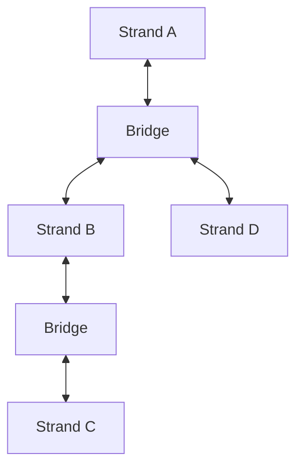

## Key Features

- **Adaptive Strand Architecture**: Independent blockchains with customizable consensus and validation
- **Secure Bridge Protocol**: Cross-strand communication with flexible transaction routing
- **Modular Chain Configuration**: Customize chain parameters and features per strand
- **Dynamic Evolution**: Add and modify strands at runtime to adapt to changing needs
- **Enterprise Ready**: Support for both permissioned and permissionless modes

## Architecture Overview



## Getting Started


```bash
#Clone the repository
git clone https://github.com/adaptique/core.git
#Build from source
cd core
cargo build --release
```

## Latest Updates


  


## Community

- [GitHub](https://github.com/adaptique)
- [Discord](https://discord.gg/adaptique)
- [Documentation](/docs/)
